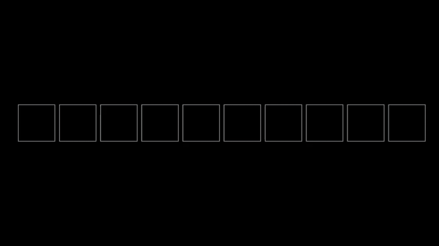

# std::stable_partition with manim

## Links
- [std::stable_parition](https://en.cppreference.com/w/cpp/algorithm/stable_partition)
- [manim](https://github.com/ManimCommunity/manim/)

## Dependencies
The animations were made with the [manim](https://github.com/ManimCommunity/manim/) animation engine.
It is mainly used for math videos, and got initally developed by [3Blue1Brown](https://www.3blue1brown.com/).


## std::stable_partition

More detailed information at [cppreferences.com](https://en.cppreference.com/w/cpp/algorithm/stable_partition).

### Defined in \<algorithm\>
```C++
template< class BidirIterator, class UnaryPredicate >
    BidirIterator stable_partition( BidirIterator first, BidirIterator last, UnaryPredicate p );
```

### Effect
std::stable_partition reorders the elements in the range [first, last) in such a way that all elements for which the predicate p returns true precede the elements for which predicate p returns false. Relative order of the elements is preserved. 

### Return 
Iterator to the first element of the second group 

### Complexity
Given N = `std::distance(first, last)`,
1) Exactly N applications of the predicate and O(N) swaps if there is enough extra memory. If memory is insufficient, at most N log N swaps.
1) O(N log N) swaps and O(N) applications of the predicate

## Build

Debug with low quality: 
```
$ python3 -m manim -p -ql stableParition.py AdditionalMemory

$ python3 -m manim -p -ql stableParition.py InPlace2
```

High quality output:

```
$ python3 -m manim stableParition.py SquareToCircle

$ python3 -m manim stableParition.py InPlace2
```

## Animations

### Additional Memory



### In-Place


